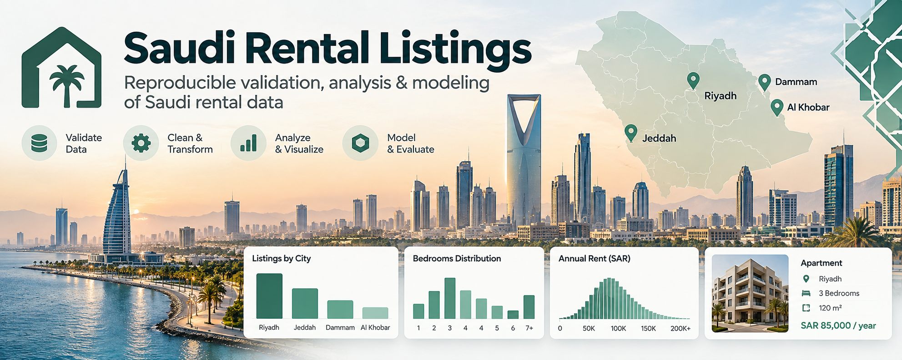
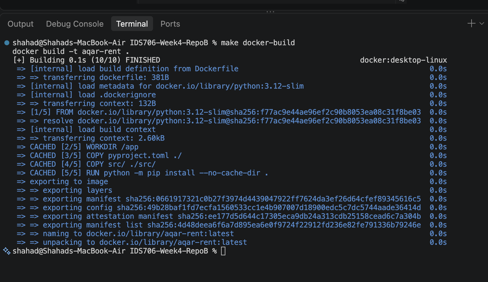
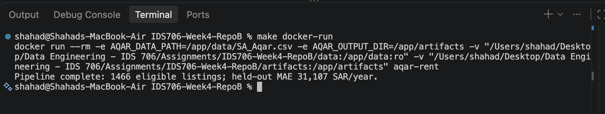
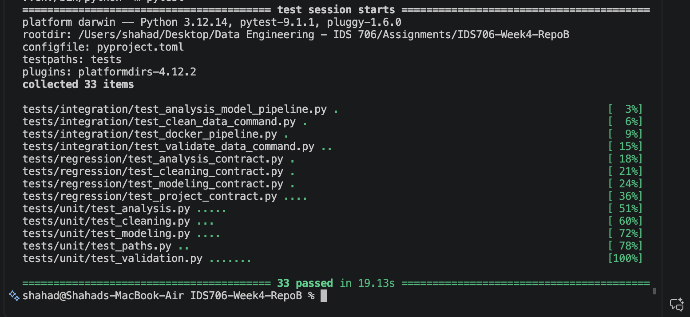

# Saudi Rental Listings: What Makes Rent Expensive?

## Option and purpose

I chose **Option 3: a new project**. I wanted to discover new data and answer a question that matters to anyone looking for a house in Saudi Arabia:

**What makes a rental house expensive in Saudi cities, and can I estimate a fair yearly rent?**

I used real rental listings scraped from Aqar (عقار) for Riyadh, Jeddah, Dammam, and Al-Khobar. The project validates and cleans the data, analyzes it, trains a reference rent model, and runs the whole pipeline in Docker. The estimates are based on asking prices, not signed contracts, so they are a reference and not an official valuation.

## Key findings

- **Jeddah is the most expensive city** in this sample, with a median asking rent of 100,000 SAR/year, followed by Riyadh (80,000), Al Khobar (65,000), and Dammam (60,000).
- **Size matters most** for rent, followed by air conditioning, property age, pool, and city. Once size is known, the number of bedrooms barely matters, and garage, bathrooms, and street orientation do not matter at all.
- **Duplicates were hiding a city imbalance.** 2,207 of the 3,718 rows were exact duplicates. The raw file looked balanced, but Al Khobar went from 976 rows to only 83 real listings, while Riyadh has 896. Most of what the model learns comes from Riyadh and Jeddah.
- **The model is useful but not exact.** Its average error on held-out listings is 31,107 SAR/year, which is better than simply guessing the city median (41,271 SAR/year).

## Setup

Use Python 3.12 and the project-local virtual environment:

```sh
make install
make test
```

The Makefile is the supported interface. Raw input defaults to
`data/SA_Aqar.csv`; set `AQAR_DATA_PATH` to use another CSV. Generated files
default to `artifacts/`; set `AQAR_OUTPUT_DIR` to change that location.

## Obtain the data

Download `SA_Aqar.csv` from [Saudi Arabia Real Estate (AQAR) by Lama Alharbi](
https://www.kaggle.com/datasets/lama122/saudi-arabia-real-estate-aqar) using
your Kaggle account. Place the file at `data/SA_Aqar.csv`. The raw file is
ignored by Git; do not commit or copy it into the project image. Tests use small
synthetic fixtures and do not need the Kaggle download.

## Data labels

The following source categories are translated for readers and charts:

| Field | Arabic value | English label |
|---|---|---|
| `city` | الخبر | Al Khobar |
| `city` | الدمام | Dammam |
| `city` | الرياض | Riyadh |
| `city` | جدة | Jeddah |
| `front` | جنوب | South |
| `front` | جنوب شرقي | Southeast |
| `front` | جنوب غربي | Southwest |
| `front` | شرق | East |
| `front` | شمال | North |
| `front` | شمال شرقي | Northeast |
| `front` | شمال غربي | Northwest |
| `front` | غرب | West |
| `front` | 3 شوارع | Corner |
| `front` | 4 شوارع | Corner |

## Current commands

`make validate-data` checks the retained structured fields. `make clean-data`
writes the transformed table and audit summary. `make analyze` creates city and
property summaries plus PNG charts; `make train` writes a held-out reference
model report. `make pipeline` runs those steps in order. Generated reports,
figures, and model files live under `artifacts/`.

The analysis reports deduplicated and eligible listing counts by city. The
bedroom chart shows sample counts and groups seven or more bedrooms as `7+`.
Rent charts use yearly SAR and thousands separators. The model report compares
held-out MAE and median absolute error with a city-median baseline, reports
errors and sample sizes by city, and includes permutation importance measured
on the held-out set. Importance is descriptive, not causal; correlated inputs
can share or mask one another's importance.

## Docker

With Docker Desktop running and the local Kaggle file in `data/`, run:

```sh
make docker-build
make docker-run
```

The image uses Python 3.12 and defaults to the full validation, cleaning,
analysis, and training pipeline. `data/` is excluded from the build context and
mounted read-only at `/app/data`; generated `artifacts/` are mounted writable
at `/app/artifacts`. The container does not download the dataset. The same
pipeline can be run locally with `make pipeline`.





## Manual smoke test

After the Builder finished and before starting the Tester, I ran the project myself from a clean state:

```sh
make clean
make test
make pipeline
cat artifacts/reports/cleaning_summary.txt
cat artifacts/reports/model_summary.md
make docker-build
make docker-run
```

| Step | Result |
|---|---|
| `make test` | 33 passed |
| `make validate-data` | 3,718 records, 2,207 duplicate rows |
| `make clean-data` | 1,511 rows after removing duplicates, 45 excluded by the price/size rules, 1,466 used for analysis |
| `make train` | held-out MAE 31,107 SAR/year (baseline 41,271) |
| `make docker-run` | same result inside the container: 1,466 eligible listings, MAE 31,107 |

I also opened the five charts in `artifacts/figures/` to check that the titles were in English and matched the numbers.

Everything worked, but running it myself showed two problems that the automated tests did not catch:

1. **Every `make` command reinstalled the whole project.** The `pip install` output appeared 5 times during one `make pipeline` run.
2. **Two typos in the model report:** "columnat a time" and "valuation.A random holdout".

The Tester did not find these either, so I added them to the fixes. After the fixes, `make pipeline` no longer reinstalls anything and the report reads correctly. The final suite has **42 passing tests**.



## AI-assisted workflow

I used GitHub Copilot Chat in VS Code (Auto model, which resolved to GPT-6 Luna) in three separate chats. The only thing the chats shared was the repository and `docs/plan.md`. The full conversations are in [`docs/transcripts/`](docs/transcripts/).

### How each role contributed

- **Architect:** inspected the data and wrote [`docs/plan.md`](docs/plan.md) with six stages, each with tests and a manual smoke test. It found the duplicates, phone-like numbers in the `details` column, and the extreme sizes and prices on its own. It left the important decisions open for me, so I answered them: remove exact duplicates, treat price as yearly SAR and size as m², exclude prices outside 10,000–500,000 SAR and sizes outside 50–2,000 m², drop `details` completely, never commit the CSV, translate the Arabic categories, and keep `district` out of the model and the charts.
- **Builder:** implemented the plan in four rounds, and I asked it to stop after each one so I could review. After every round I asked for corrections, for example the real duplicate count, the correct Kaggle link, a weak privacy test, an untrimmed `city_raw`, unknown `front` values passing silently, a misleading bedroom chart, and chart labels that used code names.
- **Tester:** reviewed the project in a fresh chat, like a pull request it did not write. It compared the code with the plan, ran the tests, black, flake8, and Docker, and checked edge cases such as the exact price and size boundaries and an empty CSV. It reported four findings; I accepted two and rejected two (below), and added the two problems from my smoke test.

### Recommendations I accepted

- **Dropping `details` while loading** (Architect). The column contains phone numbers in hundreds of listings, so it is never kept, used, or printed.
- **Keeping excluded outliers flagged in the report** instead of silently deleting them (Architect), so every exclusion can be checked.
- **Comparing the model with a simple city-median baseline** (Architect), which shows whether the model actually helps.
- **Adding tests for the exact boundaries** (10,000 / 500,000 SAR and 50 / 2,000 m²) and for an empty CSV (Tester).
- **Adding the baseline's median error** to the model report for a fair comparison (Tester).

### Recommendations I changed or rejected

- **Using `district` in the model (rejected).** The Architect planned to use it, but there are 174 districts and only about 1,500 unique houses, so many districts have only 1–3 listings and the model would overfit. The district names are also in Arabic, which matplotlib cannot display correctly.
- **"`details` must never be read" (rejected).** The Tester flagged that the loader briefly reads the column before dropping it. To find where each CSV record ends, the parser has to scan that field because descriptions contain line breaks. What matters for privacy is that the text is never stored, used, or output, so I had the plan reworded instead of changing the code.
- **Keeping the original spaces in `city_raw` (rejected).** The Tester suggested it, but I had asked the Builder to strip them on purpose because the spaces have no meaning.
- **Things the AI missed that I caught:** the Architect ignored the `front` column completely (I explained that "3 شوارع" and "4 شوارع" mean a corner house on 3 or 4 streets). Its first Docker plan only ran `analyze`, which would crash in a fresh container without cleaned data. Its integration tests needed the real Kaggle CSV even though we decided not to commit it. I also asked the Builder to add permutation importance, because nothing in the project answered the "what makes rent expensive" half of my question. I asked for it instead of the model's built-in importances or coefficients, because I learned in Repo A that correlated features make those misleading.

## How I verified the result myself

- I reviewed the code and outputs after every Builder round before allowing it to continue, and sent corrections each time.
- I ran the manual smoke test myself from a clean state, including Docker, and compared the numbers with what I had seen when exploring the raw data (for example 2,207 duplicates and 1,511 unique listings).
- I checked that the raw CSV stays unchanged, is ignored by Git, and is not inside the Docker image.
- I checked that the tests do not need the Kaggle file, so anyone who clones the repo can run them.
- I looked at every chart to make sure the titles matched the actual numbers and that no Arabic text or personal data appeared.

## Repo A vs Repo B

In Repo A I built the sleep analysis step by step myself, so it was slower, but I understood every line I wrote. In Repo B the AI wrote most of the code very quickly: a full pipeline, 42 tests, and Docker in one afternoon. But the speed only worked because I kept reviewing. The AI made confident small mistakes, and it missed things that needed domain knowledge, like the Arabic street values and the fact that dropping `details` changed the number of duplicates. The biggest difference for me was my role: in Repo A I was the programmer, and in Repo B I was the one making the decisions and checking the work. Having `docs/plan.md` as a shared contract is what made three separate chats possible.

## Transparency

Besides the three Copilot chats, I used a separate AI assistant (Claude) as a coach. It helped me choose the dataset, review each round, run some verification checks, draft some of my follow-up messages, and draft this README reflection, which I then reviewed and edited. The decisions in this project are mine. The banner image at the top was generated with ChatGPT for design only.